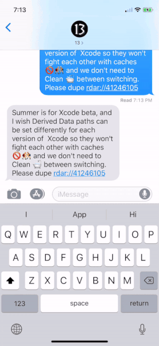

# Ladybug 🐞

Ladybug is a simple iOS app handles Radar links ([rdar://](rdar://)) gracefully.

## Demo

## Features

| | Features |
| --- | --- |
| 😇 | Open source iOS project written in Swift 4 |
| 😎 | Opens a radar link from other app, clipboard, or manually input |
| 💪 | Redirects to [Open Radar](https://openradar.appspot.com/), [Apple Radar](https://bugreport.apple.com/) (Bug Reporter) or [Brisk](https://github.com/br1sk/brisk-ios) app |
| 💡 | Support multiple formats of radar links |
| 👁 | Safari Reader mode for [Open Radar](https://openradar.appspot.com/) |
| 👀 | 3D Touch Peek & Pop |
| 🕑 | History |
| 📖 | Bookmarks |
| 📲 | Retrieve radar data from [Open Radar](https://openradar.appspot.com/) |
| ⏬ | Import your radars from [Open Radar](https://openradar.appspot.com/) |
| ⏫ | Export radars as JSON |
| 🆓 | Free without ads |
| 🚫 | No third-party tracking or analytics |

Developers have mixed feeling about radars. Lots of radars never get close or response. Ladybug doesn't try to “fix” this situation, it just helps you to manage radar links or retrieve your records from Open Radar. If you want to file a radar while cross-posting to Open Radar, consider using [Brisk](https://github.com/br1sk/brisk-ios). 

## Install

Download the official release version from [App Store](https://itunes.apple.com/us/app/ladybug-handles-radar-links/id1402968134?l=zh&ls=1&mt=8&ct=README).

Or, you can install this open source app with the following steps:

- Clone the repo on [GitHub](https://github.com/ethanhuang13/ladybug)
- Open the project with Xcode 9 or above
- Change bundle ID to something like `com.yourcompany.Ladybug`
- Build and run on your iOS devices

## Contribution 

- Feedback and [issues](https://github.com/ethanhuang13/ladybug/issues/new) are welcome

## Motivation

As an iOS developer, I follow a lot of developers on Twitter. It's painful every time I saw a [rdar://](rdar://) link in Tweetbot but cannot tap it to open. Therefore I created Ladybug, a solution for iOS to open or bookmark Radar links.

I use a lot of tools made by other developers. And I always want to contribute something to the community. With Ladybug I finally found something: **1.** I need. **2.** others might need too. **3.** I can do. Consider Ladybug my love letter to Apple dev community 😍. Enjoy!
